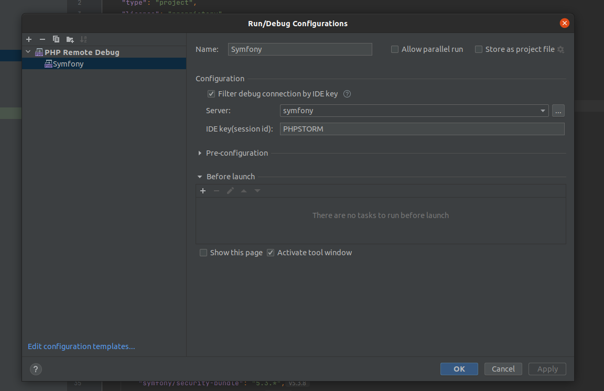
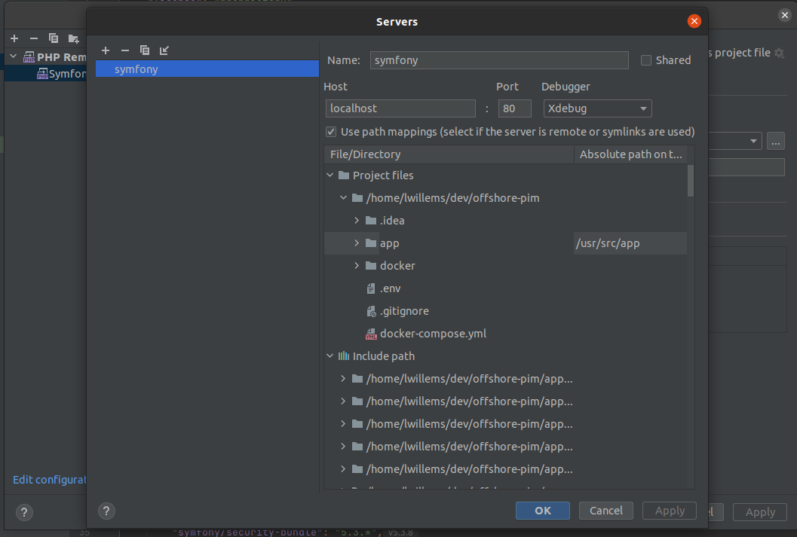

### Xdebug setup

To know your ip on linux : 
```bash
 ifconfig docker0
 ```

If your one is not 172.17.0.1 then update in .env client_host

On PHPStorm, you just have to click on the button Start Listening for PHP Debug Connections on the Run menu.




### Permission issues

You can replace your user to avoid permission issue in .env : LOCAL_USER

To know your user/group on linux :
```bash
 id
 ``` 
